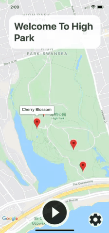
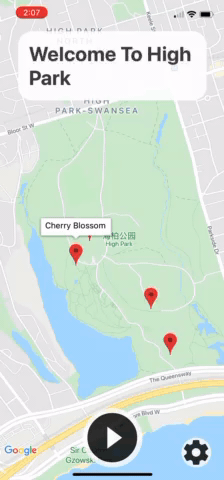

# Ontario Park

## Description 

Ontario Park is a geo-audio and realtime-locating mobile application that provides natural, cultural, and historical information and anomalies of Ontario parks based users’ interest. Our application aims to solve the problem of a lack of access of informatino of your surrounding when you are walking in parks.

Imagine walking in a part and seeing a beautiful plant or am amazing architecture but you have no resource to learn about what is that beautiful plant or what is the background story of that amazing architecture. Our application will provide you with that information as you are walking in the park!

To simplify the limit the scope of our problem statement, we focus on providing natural, cultural, and historical information in High Park.


 
## Key Features
  * Frontend:
    * Displays points of interests and allows user to choose between them by clicking the markers <br />
    
    * Provides more knowledge by having a detail page that is accessed by clicking the text pop out after clicking the marker <br />
    
    * Having a interactive map that allows user to see different part of the park as well as location of infrastructures <br />
    
    * Plays audio of the location by clicking the play button after choosing the marker you want to hear about <br />
    
    * Access accessibility page through a choice in the setting <br />
    

 * Backend:
   * By visiting the url https://ontario-park.herokuapp.com/api/attractions, users can retrive the following information
     * Getting a list of all the tourist attractions
     * The longitude and latitude of each of the tourist attractions
     * A description of each of the tourist attractions
     * A url to the audio file and the image file of each of the tourist attractions

 * Described the key features in the application that the user can access
 * Provide a breakdown or detail for each feature that is most appropriate for your application
 * This section will be used to assess the value of the features built

## Instructions

 The backend application is hosted on heroku and we currently have one route (get all tourist attractions) that is functioning. If users are interested in accessing the API of our application, they can simply visit https://ontario-park.herokuapp.com/api/attractions. 

 * Clear instructions for how to use the application from the end-user's perspective
 * How do you access it? Are accounts pre-created or does a user register? Where do you start? etc. 
 * Provide clear steps for using each feature described above
 * This section is critical to testing your application and must be done carefully and thoughtfully
 
 ### Development requirements
 Development Requirements
 ### Front End Development Installing
 **developer need to do installation both on the mobile device and PC to run the application**.
 
 #### Installation on laptop
 install Node js in the local machine.
 ```
 https://nodejs.org/en/download/
 ```
 install expo in the local machine (Windows):
 ```
 npm install expo-cli --global
 ```
 install expo in the local machine (Linux/MacOS):
 ```
 sudo npm install expo-cli --global
 ```
 
 Clone this repository to local machine.
 ```
 https://github.com/csc301-fall-2020/team-project-15-ontario-parks.git
 ```
 change directory on terminal to the project front end location and run npm i to install all the dependency.
 ```
 cd <project_location>
 cd ./deliverable-2/MobileFrontend/OntarioPark
 npm i
 ```
 
 ### Installing on mobile device
 **ios device:**
  - open app store on the device and download *Expo Client*.
 
 **android device:**
  - open Google Play store on the device and download *Expo*.

 ### Backend Development Installing:
   * Install Node.js on your local machine.
   * Step into the backend project directory and run `npm install` in terminal
   * Run `npm start` in terminal
  
  
 ## Deployment and Github Workflow
 
  * Frontend:
  
      We made a branch called MobileUI where the mobile frontend development takes place. Each member in the frontend team is responsible for one or two screens and we allocate the rest of the work(such as connection with backend) in a case by case manner. This allows us to prevent conflicts since we are working on different part of the same code base. 
 
      We tried to make pull requests on the MobileUI branch for parts and any other team member who reviews the code can merge it. However, we are not able to continue using this because of our time constraint and because all of our components are closely related and need to interact between each other. We are planning to adopt the workflow described above in Phase 3 as we will be adding new features rather than creating everything all at once. 

      We chose camel case for our naming as this is the standard for javascript. 

      As we are developing React Native application using Expo, we are able to view the live application as we are writing and modifying the code and that is our deployment process when writing code. Expo also acts as a package manager and provides us the ability to link resources automatically and provide service for building and deploying the application as an apk file. We only use Expo to deploy to apk when we are finished because, as stated above, we are able to see live updates on our simulator/device when developing.  

      We chose the workflow using pull request because it adds another guard towards erroneous code and prevents it from merging into more important branches. However, this is also why we did not employ it for the same reason as we are all writing code that are interdependent. We used Expo for our deployment because it offers features such as ability to see the update to the application directly on the phone that substantially improves our efficiency when making changes.

    
    
  * Backend:
  
      Each team member in the backend team is responsible for handling one portion of the backend application. Ka Chun Mo first setup the code and the folder structure of the backend application, connected the application to our database (MongoDB), and hosted the application on heroku. Zhiyuan Sun then implemented the API of our application. Wang Ting Shu is responsible for setting up the crucial part of storing our audio and image files in our DigitalOcean server. Since we divided our tasks in a sequential manner, there is no conflicts in our backend applications.

Describe your Git / GitHub workflow. Essentially, we want to understand how your team members shares a codebase, avoid conflicts and deploys the application.

 * Be concise, yet precise. For example, "we use pull-requests" is not a precise statement since it leaves too many open questions - Pull-requests from where to where? Who reviews the pull-requests? Who is responsible for merging them? etc.
 * If applicable, specify any naming conventions or standards you decide to adopt.
 * Describe your overall deployment process from writing code to viewing a live applicatioon
 * What deployment tool(s) are you using and how
 * Don't forget to **briefly explain why** you chose this workflow or particular aspects of it!

 ## Licenses 

 Keep this section as brief as possible. You may read this [Github article](https://help.github.com/en/github/creating-cloning-and-archiving-repositories/licensing-a-repository) for a start.

 * What type of license will you apply to your codebase?
 * What affect does it have on the development and use of your codebase?
 * Why did you or your partner make this choice?
